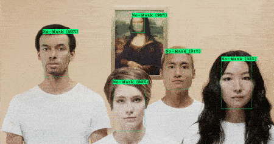
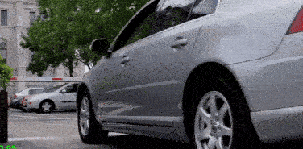

# 2D Objects Detection Use Cases

This is a place where I document my experiments in 2D objects detection. For each set of experiments, I try to include the :

* **Framework** : `darknet`, `tf-detection api`, `torchvision`, ...
* **Model** : YOLO, Faster R-CNN, ...
* **Dataset** : The dataset, as well as its description.
* **Training/Evaluation configurations** : nb. of epoch, batch size, ... 
* **Metrics** : The learning curve and the `mAP`. 
* **Image and Video results** : The result of the detection as bounding boxes on images and/or videos.

## Use cases

Each use case is about detection. For example, "Face mask" means "Face mask detection." 

| Use case      | Model         | Results  |
| ------------- | ------------- |:--------:|
| [Face mask](yolo_face_mask_detection/README.md)     | YOLO v3/v4 |  |
| [Registration plate](license_plate_recognition/README.md)     | Faster R-CNN |  |
