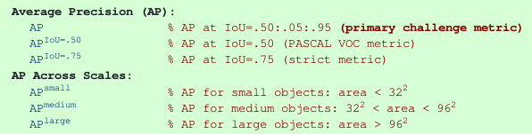

# License Plate Detection

The goal is to localize vehicle's registration plate. 

## Framework

I am using `torch==1.7.1` and `torchvision==0.8.2` to build the model, do the training/evaluation and make predictions.

## Model

The two-stage detector `Faster R-CNN` is used. Specifically, `torchvision` implementation : it's a pre-trained model on the **COCO** object detection dataset, and the model's head is trained from scratch. PYTORCH TUTORIAL

```python
import torchvision
from torchvision.models.detection.faster_rcnn import FastRCNNPredictor

def faster_rcnn_pretrained_model(num_classes):
    # load a model pre-trained on COCO
    model = torchvision.models.detection.fasterrcnn_resnet50_fpn(pretrained=True)

    # get number of input features for the classifier
    in_features = model.roi_heads.box_predictor.cls_score.in_features
    # replace the pre-trained head with a new one
    model.roi_heads.box_predictor = FastRCNNPredictor(in_features, num_classes)

    return model
```

## Dataset

The dataset is extracted from [**Open Images Dataset**](https://storage.googleapis.com/openimages/web/visualizer/index.html?set=train&type=detection&c=%2Fm%2F01jfm_), filtering the category `"Vehicle registration plate"`. It was processed to have the following structure :

```bash
Dataset
├── train
│   └── Vehicle registration plate
│       └── Label
└── validation
    └── Vehicle registration plate
        └── Label
```

`Vehicle registration plate/` contains the images, and `Label` the annotations. 

Distribution :
- The `train` split contains **5308** images, 
- The `validation` split contains **386** images.

## Training and Evaluation configuration

## Metrics

The model achieved an `mAP` of **57.28%** (COCO primary metric).

Among the [12 metrics used for characterizing the performance of an object detector on COCO](https://cocodataset.org/#detection-eval), I implemented 6 :


I also included the **AP@[IoU=0.50, IoU=0.75]** for **small, medium** and **large** areas :

```bash
Average Precision  (AP) @[ IoU= 0.50:0.95 | area=all ] = 57.28%
Average Precision  (AP) @[ IoU=      0.50 | area=all ] = 88.98%
Average Precision  (AP) @[ IoU=      0.75 | area=all ] = 68.12%

Average Precision  (AP) @[ IoU= 0.50:0.95 | area=small ] = 27.41%
Average Precision  (AP) @[ IoU=      0.50 | area=small ] = 55.15%
Average Precision  (AP) @[ IoU=      0.75 | area=small ] = 20.40%

Average Precision  (AP) @[ IoU= 0.50:0.95 | area=medium ] = 61.02%
Average Precision  (AP) @[ IoU=      0.50 | area=medium ] = 90.31%
Average Precision  (AP) @[ IoU=      0.75 | area=medium ] = 77.04%

Average Precision  (AP) @[ IoU= 0.50:0.95 | area=large ] = 61.82%
Average Precision  (AP) @[ IoU=      0.50 | area=large ] = 91.51%
Average Precision  (AP) @[ IoU=      0.75 | area=large ] = 75.53%
``` 

## Image and Video results