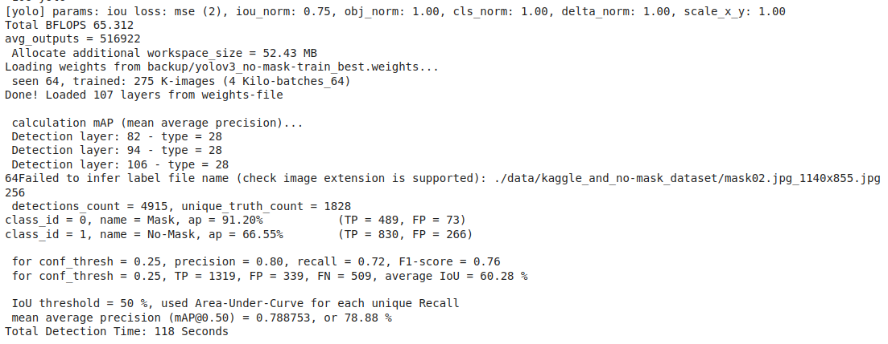
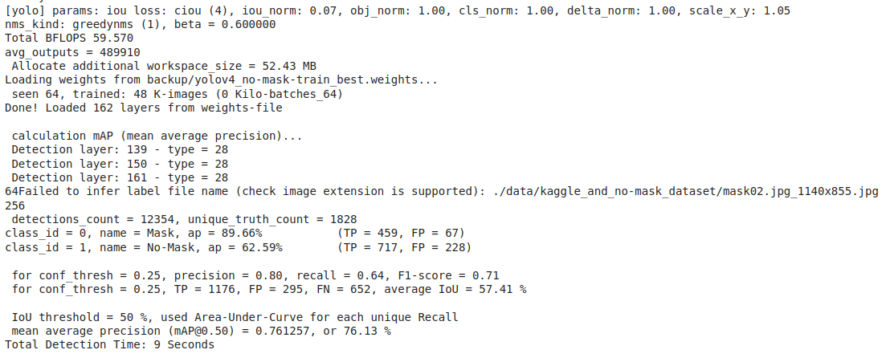
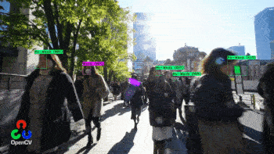

# Face Mask Detection

The goal is to determine if a person wears a mask.

## Framework

It's [darknet](https://github.com/AlexeyAB/darknet).

## Model

**YOLO v3** and **[**YOLO v4**.**

## Dataset

The dataset consists of people in various conditions ("in the wild"), either wearing a mask or not. Hence, there are two classes to detect : **Mask** and **No-Mask**.

The dataset is split into :
- a `train` set, containing **1014** images.
- a `test` set, containing **255** images.

Each image is associated with a label file (in yolo format), resulting in the following structure :
```bash
kaggle_and_no-mask_dataset
├── 000_1OC3DT.jpg
├── 000_1OC3DT.txt
├── 000_1ov3n5_0.jpeg
├── 000_1ov3n5_0.txt
...
```

## Training and Evaluation configuration

For full configurations, you can look inside the folder `cfg`.

**Yolo v3**

For `training` :
```ini
batch=64
max_batches=6000
learning_rate=0.001

width=416
height=416
```

For `evaluation` :
```ini
batch=1
max_batches=6000
learning_rate=0.001

width=416
height=416
```

**Yolo v4**

For `training` :
```ini
batch=64
max_batches=4000
learning_rate=0.001

width=416
height=416
```

For `evaluation` :
```ini
batch=1
max_batches=6000
learning_rate=0.001

width=416
height=416
```

## Metrics

**Yolo v3**

The model achieved a maximum `mAP` of **78.86%**.



**Yolo v4**

The model achieved a maximum `mAP` of **76.13%**.



## Results

**Yolo v3**

Video result :


**Yolo v4**

Video result : 

